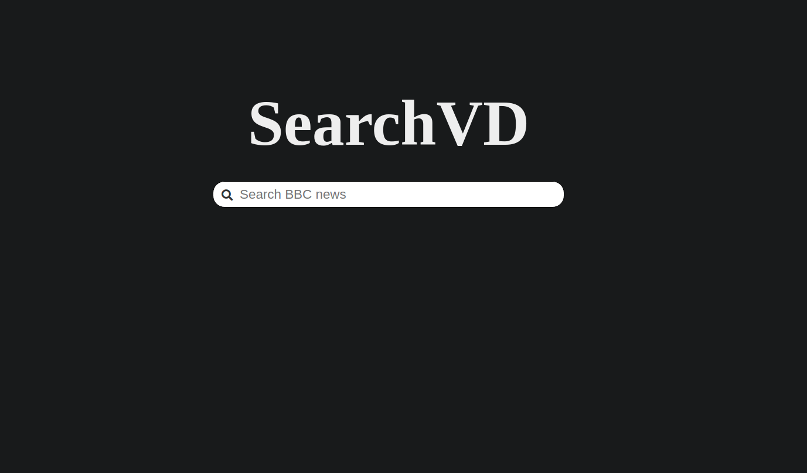
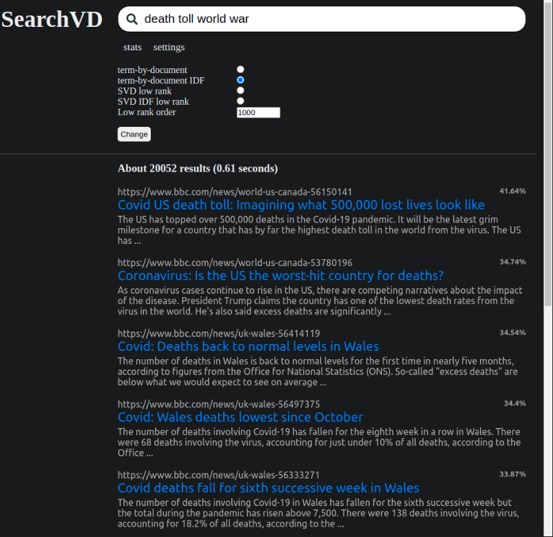
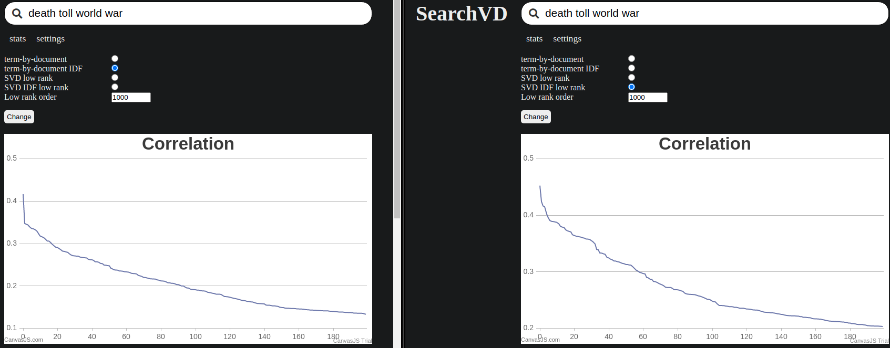
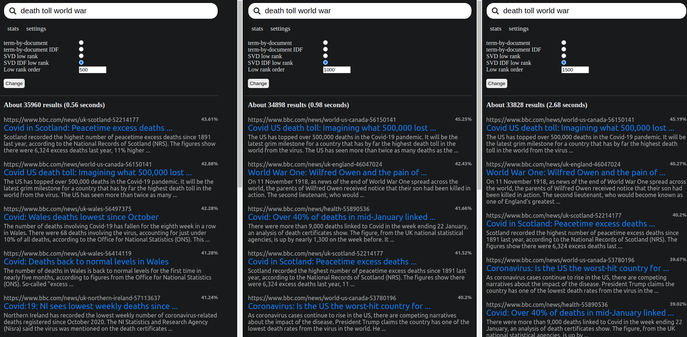

# SearchVD

## Project created for numerical methods course containing:

- Search Engine written in Python, with REST API server built using Django framework
- Frontend written in plain HTML, CSS and JS 
- Web Crawler written in Python used to gather documents for the Search Engine

---

 

## How does it work?

The Crawler downloaded over 50k documents from the BBC news website. Documents were preprocessed for the search engine using natural language processing (NLP) methods from the nltk library.

The Search Engine uses sparse matrix technology and bag-of-words representation of downloaded documents, with which it calculates the cosine norm to estimate how much the entered phrase matches a given document. Then it sends to the browser client a predefined number of documents with the greatest correlation score.

SVD matrix decomposition with low rank approximation is used to further reduce the noise in the document dataset and allow the search engine to find documents based on semantic search, not just keyword search.

Libraries:
- numpy
- scipy
- nltk

Frontend was designed to be a Google Search clone with some extra information about the quality of the search engine results.

Note that Django is certainly overkill for a couple of simple REST endpoints. It was used only because I needed to learn it for some other project at that time.

---

 

## Presentation

### Main window. Here the user can enter search phrases.

 

### Search resutls window. At the top, we can see the entered search phrase. Below, we have search settings, and under that, we can see the search results. The correlation between the search phrase and that document can be seen on the right.

 

### More Documents are loaded as requested (200 documents per request, so we have 20 pages without the need to send additional requests).

 

### We can compare correlation results using a more sophisticated search method such as SVD vs. the simpler TBD IDF method.

 

### Since SVD computations for different low rank orders are cached on the server, we can change them from the browser to observe differences in search results. If the chosen order was not cached before, the user will be notified that his request will take some time. The server computes the SVD approximation in a separate thread.

